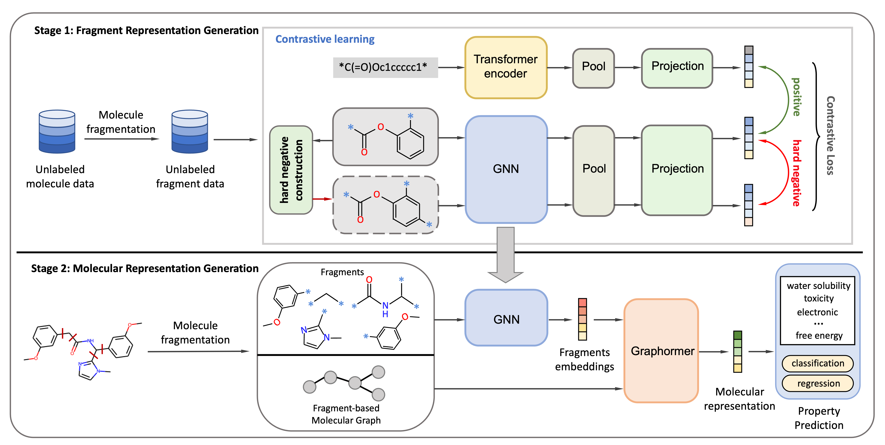

# CAFE-MPP: Self-Supervised Learning with Chemistry-aware Fragmentation for Effective Molecular Property Prediction

#### Briefings in Bioinformatics[[Paper]](https://academic.oup.com/bib/advance-article/doi/10.1093/bib/bbad296/7246472) [[PDF]](https://academic.oup.com/bib/advance-article-pdf/doi/10.1093/bib/bbad296/51175671/bbad296.pdf) </br>
[Ailin Xie](https://scholar.google.com/citations?user=NjycP1MAAAAJ&hl=en), [Ziqiao Zhang](https://scholar.google.com/citations?user=c1MO4dUAAAAJ&hl=en), [Jihong Guan](https://admis.tongji.edu.cn/82/08/c25113a229896/page.htm), [Shuigeng Zhou](https://admis.fudan.edu.cn/sgzhou/) </br>
Fudan University, Tongji University</br>

This is the official implementation of <strong><em>CAFE-MPP</em></strong>: [" Self-Supervised Learning with Chemistry-aware Fragmentation for Effective Molecular Property Prediction
"](https://academic.oup.com/bib/advance-article-pdf/doi/10.1093/bib/bbad296/51175671/bbad296.pdf).



## Setup
### Installation
    # conda environment
    conda create --name CAFE-MPP python=3.8
    conda activate CAFE-MPP

    # install requirements
    conda install pytorch==1.11.0 torchvision==0.12.0 torchaudio==0.11.0 cudatoolkit=11.3 -c pytorch
    conda install pyg -c pyg
    conda install -c conda-forge rdkit
    conda install -c anaconda cython

    # clone the source code
    git clone https://github.com/shiokoo/CAFE-MPP.git
    cd CAFE-MPP

### Dataset
We provide the preprocessed pre-training fragment dataset used in this project. Besides, You can download the benchmarks ***MoleculeNet*** used in this project by running the following command:

    cd ./Data
    bash download_data.sh

### Pre-training
To pre-train the CAFE-MPP, where the configurations and hyperparameters are defined in `./Config/config_pretrain.yaml`.

    cd ./Pretrain
    python trainer.py

### Prediction
To fine-tune the CAFE-MPP, where the configurations and details are can be found in `./Config/config_prediction.yaml`.
    python setup.py build_ext --inplace # generate .so
    cd ./Prediction
    python trainer.py

If you find our work is helpful in your research, please cite:
```
@article{xie2023cafe-mpp,
    author = {Xie, Ailin and Zhang, Ziqiao and Guan, Jihong and Zhou, Shuigeng},
    title = "{Self-supervised learning with chemistry-aware fragmentation for effective molecular property prediction}",
    journal = {Briefings in Bioinformatics},
    pages = {bbad296},
    year = {2023},
    month = {08},
    issn = {1477-4054},
    doi = {10.1093/bib/bbad296},
    url = {https://doi.org/10.1093/bib/bbad296},
    eprint = {https://academic.oup.com/bib/advance-article-pdf/doi/10.1093/bib/bbad296/51175671/bbad296.pdf},
}
```

